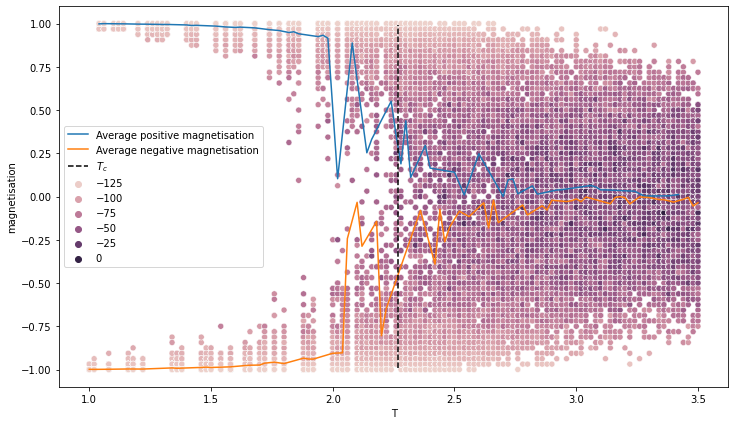
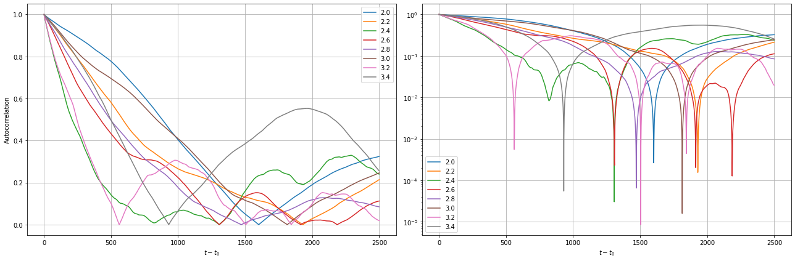
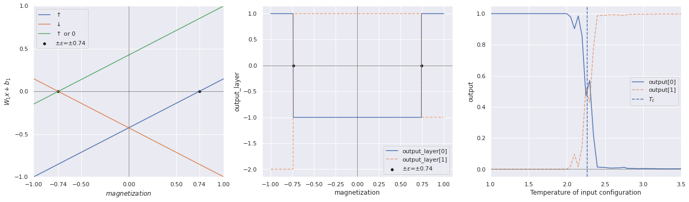
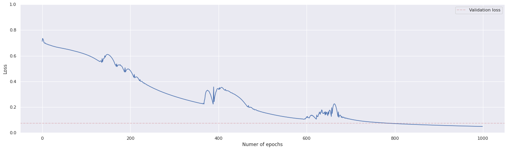
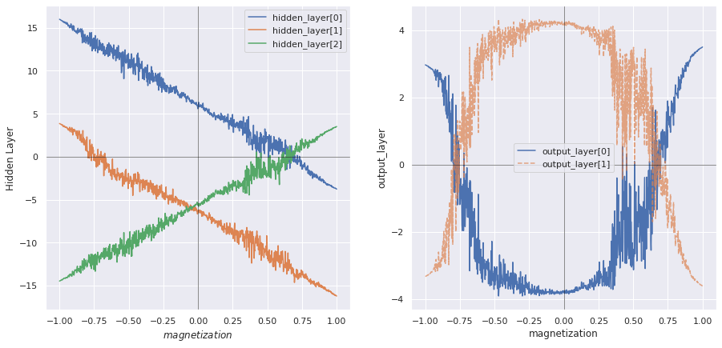
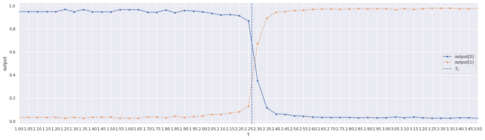

# Machine Learning phases of matter
## Abstract
This project aims to reobtain the results presented in [Machine learning phases of matter (Juan Carrasquilla, Roger G. Melko)](https://arxiv.org/abs/1605.01735) regarding the two-dimensional square Ising model. The authors show that a standard _feed-forward neural network_ (FFNN) is a suitable tool to detect Ising's model phase transition.  
This is done by first comparing the behavior of a _fully connected neural networr_ (FCNN) to a hand-made Toy model.  
Then the number of parameters of the FCNN is increased and the accuracy of the model is studied as a function of the lattice size to remove boundary effects.   In the original article, the FCNN is then upgraded to a _convolutional neural network_ to test its accuracy on non-Ising Hamiltonians.  
Finally, as an appendix, the original data is analyzed with the _t-stochastic neighbors embedding_ algorithm to separate the data into clusters.

> :grey_exclamation: The project is subdivided into notebook written to be run on [google colab](https://colab.research.google.com/). A copy is provided in this repository but they may not run in your local environment. It is possible to access the original notebooks using the link provided. 

> :grey_exclamation: Some images may not display properly if GitHub's dark mode is active. If that's the case please change mode or open the plots one by one.

## Notebooks
The following section presents a summary of the results obtained. A more detailed discussion is available inside the notebooks themselves. 

### 01 Monte Carlo simulation
[Google colab link](https://colab.research.google.com/drive/1de9nkvQpTHr8AZuaSgxCjmR14VqJ5I4F?usp=sharing)

The first notebook is centered around the Monte Carlo code `MonteCarloSampling.c` written to generate the configurations.
In particular, in the notebook the behavior of the magnetization and the autocorrelation will be analyzed. Both tests will lead to positive results with a correlation length of $5000$ time steps.

##### Magnetization

##### Autocorrelation

 

### 02 The Toy model
[Google colab link](https://colab.research.google.com/drive/1VhzjsGJBBggnKgkuA9-o77eyjR3w4s2m?usp=sharing)

The second notebook focuses on the Toy Model presented in the article and examines the corresponding FCNN. The analytical toy model correctly classifies the temperature up to a parameter $\epsilon$ that was found by trial and error (an optimization procedure would have required more time without providing any real value). Then a FCNN with the same structure as the toy model is designed:
- Input layer consisting of $L^2$ neurons;
- Hidden layer with 3 neurons and a **sigmoid** activation function;
- Output layer with 2 neurons and a **sigmoid** activation function.
The activation function was switched from Heaviside to Sigmoid as suggested in the article to avoid the pathological behavior of the Heaviside's gradient.  
The network's performances have a high dependence on the stochastic component of the training. If the training goes well the test loss is smaller than 0.1 percent, otherwise, it oscillates between 0.2 and 0.4 (this problem will be solved in the third notebook). When the training goes well both the hidden layer and the output layer provide similar results to the toy model and the critical temperature is correctly identified within a small error.

##### Output of the analytical Toy model

##### Training of the FCNN Toy Model

##### Output of the FCNN Toy model

 

### 03 The Network in detail
[Google colab link](https://colab.research.google.com/drive/1alngDJg5uTnB-GwbBxkoK753OHZeg6Uw?usp=sharing)

The third notebook will be more theory-oriented. First, the Toy model FCNN will be upgraded with a hidden layer of 100 neurons, then the training procedure will be discussed in detail. Following that, the results of [Juan Carrasquilla and Roger G. Melko](https://arxiv.org/abs/1605.01735) on non-standard Ising hamiltonian will be presented.

#### Training of the improved network

 

### 04 t-SNE
[Google colab link](https://colab.research.google.com/drive/1hUy1Fy7iUTkWHX-S79e-WppUdJBHMw9E?usp=sharing)

The fourth notebook will try to implement the content of _Appendix B: Visualizing the action of a neural network on the Ising ferromagnet_ using scikit-learn's implementation of t-SNE.

**Results for various values of perplexity**  
As t-SNE uses a non-convex cost function the plot will always look different. Some plots obtained are reported _for clarity_. As they were obtained by repetitive runs until a "good-looking" plot was produced, they have little scientific meaning.

- Perplexity 100; Early Exaggeration 195

- Perplexity 100; Early Exaggeration 50; points around $T_C$ used

- Perplexity 50; Early Exaggeration 50; points around $T_C$ used

- Perplexity 30; Early Exaggeration 50; points around $T_C$ used

- Perplexity 10; Early Exaggeration 50; points around $T_C$ used

- Perplexity 4; Early Exaggeration 50; points around $T_C$ used

 

---

 

## Bibliography
- Article: [Machine learning phases of matter](https://www.nature.com/articles/nphys4035), [arxiv version](https://arxiv.org/abs/1605.01735) available in the repository.
- Pytorch tutorials: [https://pytorch.org/tutorials/](https://pytorch.org/tutorials/)
- [Understanding binary cross-entropy / log loss: a visual explanation](https://towardsdatascience.com/understanding-binary-cross-entropy-log-loss-a-visual-explanation-a3ac6025181a)
- [Differentiable Programming from Scratch](https://thenumb.at/Autodiff/): article on the inner working mechanism of the automatic differentiation algorithm of PyTorch.
- [Adam: A Method for Stochastic Optimization](https://arxiv.org/abs/1412.6980): arXiv entry for the Adam optimizer. Only the first two sections were consulted.
- [Why Momentum really Works](https://distill.pub/2017/momentum/)
- [t-distributed stochastic neighbour embedding](https://it.wikipedia.org/wiki/T-distributed_stochastic_neighbor_embedding): Wikipedia entry for t-SNE
- [How to Use t-SNE Effectively](https://distill.pub/2016/misread-tsne/)
