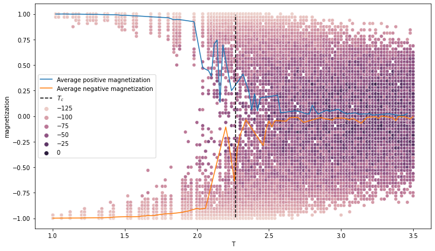

# Machine Learning phases of matter
## Abstract
This project aims to reobtain the results presented in [Machine learning phases of matter (Juan Carrasquilla, Roger G. Melko)](https://arxiv.org/abs/1605.01735) regarding the two-dimensional square Ising model. The authors show that a standard _feed-forward neural network_ (FFNN) is a suitable tool to detect Ising's model phase transition.  
This is done by first comparing the behavior of a _fully connected neural networr_ (FCNN) to a hand-made Toy model. Then the number of parameters of the FCNN is increased and the accuracy of the model is studied as a function of the lattice size to remove boundary effects.  
In the original article, the FCNN is upgraded to a _convolutional neural network_ to test its accuracy on non-Ising Hamiltonians. In this project, the convolutional network is applied only to the standard Ising model but the results of the article are reported with some considerations.
Finally, as an appendix, the original data is analyzed with the _t-stochastic neighbors embedding_ algorithm to separate the data into clusters.

> :grey_exclamation: The project is subdivided into notebook written to be run on [google colab](https://colab.research.google.com/). A copy is provided in this repository but they may not run in your local environment. It is possible to access them using the link provided.

## Notebooks
### 01 Monte Carlo simulation
[Google colab link](https://colab.research.google.com/drive/1de9nkvQpTHr8AZuaSgxCjmR14VqJ5I4F?usp=sharing)

The first notebook is centered around the Monte Carlo code `MonteCarloSampling.c` written to generate the configurations.
In particular, in the notebook, the behavior of the magnetization and the autocorrelation will be analyzed. Both tests will lead to positive results with a correlation length of $5000$ time steps.

##### Magnetization

##### Autocorrelation

### 02 The Toy model
[Google colab link](https://colab.research.google.com/drive/1VhzjsGJBBggnKgkuA9-o77eyjR3w4s2m?usp=sharing)

The second notebook focuses on the Toy Model presented in the article and examines the corresponding FCNN. The analytical toy model correctly classifies the temperature up to a parameter $\epsilon$ that was found by trial and error (an optimization procedure would have required more time without providing any real value). Then a FCNN with the same structure as the toy model is designed:
- Input layer consisting of $L^2$ neurons
- Hidden layer with 3 neurons and a **sigmoid** activation function
- Output layer with 2 neurons and a **sigmoid** activation function
The activation function was switched from Heaviside to Sigmoid as suggested in the article to avoid the pathological behavior of the Heaviside's gradient.  
The network's performances have a high dependence on the stochastic component of the training. If the training goes well the test loss is smaller than 0.1 percent, otherwise, it oscillates between 0.2 and 0.4 (this problem will be solved in the third notebook). When the training goes well both the hidden layer and the output layer provide similar results to the toy model and the critical temperature is correctly identified within a small error.

##### Output of the analytical Toy model

##### Training of the FCNN Toy Model

##### Output of the FCNN Toy model

### 03 The Network in detail

## Bibliography
- Article: [Machine learning phases of matter](https://www.nature.com/articles/nphys4035), [arxiv version](https://arxiv.org/abs/1605.01735) available in the repository.
- Pytorch tutorials: [https://pytorch.org/tutorials/](https://pytorch.org/tutorials/)
